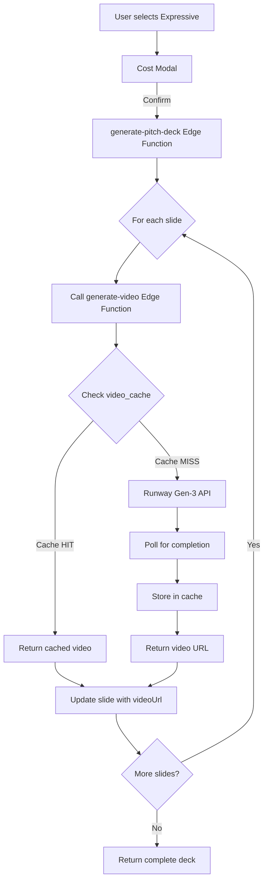

# Video Generation for Pitch Decks - User Guide

**Last Updated:** 2025-12-30
**Feature Status:** ✅ Production Ready (Phase 6 Complete)

---

## Overview

AI Query Hub's pitch deck generator now supports **Expressive Mode** with AI-generated video animations for each slide. Instead of static images, each slide displays a smooth, 3-5 second video clip that brings your presentation to life.

### Quick Facts

- **Video Generation**: Powered by Runway Gen-3 Alpha (industry-leading quality)
- **Cost**: ~$0.20 per slide (4 seconds @ $0.05/second)
- **Cache Savings**: ~35% cost reduction through intelligent caching
- **Fallback**: Automatic fallback to static images if video generation fails
- **Design System**: ANTI-AI aesthetic enforcement (no purple, gold, neon)

---

## How to Use

### 1. Select Animation Style

When creating a pitch deck, choose **"Expressive"** from the animation style dropdown:

```
Animation Style: Expressive ← Select this for video generation
```

### 2. Review Cost Estimate

Before generation, you'll see a cost estimation modal:

```
Cost Estimation
━━━━━━━━━━━━━━━━━━━━━━━━━━━━━━━━━━━━━━━━━
Expressive Mode (AI Video)
4 seconds of AI-generated video per slide using Runway Gen-3

10 slides × $0.20/slide    $2.00
Cache savings (~35%)      -$0.70
━━━━━━━━━━━━━━━━━━━━━━━━━━━━━━━━━━━━━━━━━
Estimated Total            $1.30
```

**Options:**
- ✅ **Confirm & Generate** - Proceed with video generation
- ❌ **Cancel** - Return to editing without charges
- ☑️ **Don't show this again** - Auto-approve future generations

### 3. Generation Process

Video generation takes longer than static images:

- **Static images**: ~5-10 seconds total
- **Videos (cache miss)**: ~30-60 seconds per slide
- **Videos (cache hit)**: Instant (~0 seconds)

**Progress indicators:**
- Generating slide 1/10...
- Generating slide 2/10...
- ✓ Video generated for slide 1 (cached)
- ✓ Video generated for slide 2
- ⚠ Failed to generate video for slide 3, using static image

### 4. Presentation Playback

Videos auto-play and loop during presentations:

- **Preview Panel**: Videos visible in preview
- **Full-Screen Mode**: Smooth playback with no controls
- **Presenter View**: Videos play in both current + next slide preview
- **Audience View**: Videos display on external monitors/projectors

---

## Technical Architecture

### Backend Flow



### Video Caching

Videos are cached by SHA-256 hash of:
- Enhanced prompt (includes DESIGN_SYSTEM_PROMPT)
- Duration (4 seconds)
- Aspect ratio (16:9)
- Resolution (1080p)

**Cache benefits:**
- Shared across ALL users
- Popular topics cached once, used many times
- Automatic cleanup (30+ days unused)
- Cost tracking via `use_count` field

**Database schema:**
```sql
CREATE TABLE video_cache (
  id UUID PRIMARY KEY,
  prompt_hash TEXT NOT NULL UNIQUE,
  prompt_text TEXT NOT NULL,
  video_url TEXT NOT NULL,
  duration_seconds NUMERIC,
  file_size_mb NUMERIC,
  resolution TEXT,
  created_at TIMESTAMPTZ DEFAULT NOW(),
  last_used_at TIMESTAMPTZ DEFAULT NOW(),
  use_count INTEGER DEFAULT 1
);
```

### Error Handling & Fallback

**Retry Logic:**
1. Attempt 1: Try video generation
2. Attempt 2: Retry after 1s (if 5xx or network error)
3. Attempt 3: Retry after 2s (if 5xx or network error)
4. Fallback: Generate static image instead

**Timeout Protection:**
- 90-second timeout per video generation attempt
- AbortController cancels hung requests

**Graceful Degradation:**
```
Video Generation → 5xx Error → Retry (1s)
                 → Timeout   → Retry (2s)
                 → Max Retries → Static Image Fallback
                              → Image Fails → Text-Only Slide
```

No video generation failure blocks deck generation.

### Frontend Rendering

**Component Updates:**
- `PitchDeck.tsx`: Slide interface includes `videoUrl`, `videoDuration`, `videoFileSizeMb`
- `PresenterView.tsx`: Video playback in current + next slide
- `PresentationAudience.tsx`: Video display on audience window

**Video Element:**
```tsx
{slide.videoUrl ? (
  <video
    src={slide.videoUrl}
    autoPlay
    loop
    muted
    playsInline
    className="w-full h-full object-contain"
  />
) : slide.imageData ? (
  
) : (
  // Text-only fallback
)}
```

---

## Design System Enforcement

Videos are generated with strict anti-AI aesthetic guidelines:

### ❌ Avoid (AI Clichés)

- Purple, violet, indigo, lavender tones
- Gold, metallic gold, champagne accents
- Neon or glowing effects
- Generic corporate motion graphics templates
- Overly smooth/perfect animations (robotic feel)

### ✅ Use Instead

- Warm earth tones: terracotta, browns, sage greens, olive, rust, cream
- Classic professional: navy blue, charcoal gray, forest green, burgundy
- Natural palettes: stone, sand, moss, sky blue, coral
- Organic, purposeful motion
- Human-paced reveals

**Prompt Enhancement:**
All user prompts are automatically enhanced with `DESIGN_SYSTEM_PROMPT` before being sent to Runway Gen-3.

---

## Cost Optimization

### Per-Deck Costs

| Deck Size | Video Cost | Cache Savings | Estimated Total |
|-----------|------------|---------------|-----------------|
| 5 slides  | $1.00      | -$0.35       | $0.65           |
| 10 slides | $2.00      | -$0.70       | $1.30           |
| 15 slides | $3.00      | -$1.05       | $1.95           |
| 20 slides | $4.00      | -$1.40       | $2.60           |

### Monthly Estimates

**Heavy User** (100 decks/month):
- Without caching: $200/month
- With caching: $130/month
- **Savings: $70/month (35%)**

**Medium User** (25 decks/month):
- Without caching: $50/month
- With caching: $32.50/month
- **Savings: $17.50/month (35%)**

### Cost vs. Static Images

| Feature | Static Images | Expressive Videos |
|---------|---------------|-------------------|
| Cost/slide | $0.01 | $0.20 (cache miss) / $0.00 (cache hit) |
| Generation time | 5-10s | 30-60s (cache miss) / instant (cache hit) |
| Visual impact | Good | Excellent |
| Best for | Quick iterations | Investor pitches |

---

## API Reference

### generate-video Edge Function

**Endpoint:** `POST /functions/v1/generate-video`

**Request:**
```json
{
  "prompt": "Professional bar chart growing from 0 to 100%, warm earth tones",
  "duration": 4,
  "aspectRatio": "16:9",
  "resolution": "1080p",
  "negativePrompt": "purple colors, gold accents"
}
```

**Response (Success):**
```json
{
  "videoUrl": "https://cdn.runwayml.com/videos/abc123.mp4",
  "duration": 4.2,
  "resolution": "1080p",
  "fileSizeMb": 3.8,
  "cached": false
}
```

**Response (Error):**
```json
{
  "error": "Video generation timed out after 5 minutes"
}
```

### Database Functions

**Update cache usage:**
```sql
SELECT update_video_cache_usage('cache-uuid');
```

**Cleanup old videos:**
```sql
SELECT cleanup_old_video_cache();
-- Returns: Number of deleted cache entries
```

---

## Monitoring & Debugging

### Edge Function Logs

**Supabase Dashboard** → Functions → generate-video → Logs

**Key log messages:**
- `Checking video cache: { prompt_hash: "abc..." }`
- `Cache HIT - returning cached video`
- `Cache MISS - generating new video`
- `Video generation started: { generation_id: "gen_..." }`
- `Video generation completed: { video_url: "https://..." }`
- `Storing video in cache: { prompt_hash: "abc..." }`

### Common Errors

**"RUNWAY_API_KEY not configured"**
- Solution: Add `RUNWAY_API_KEY` to Supabase environment variables

**"Video generation timed out after 5 minutes"**
- Cause: Runway API taking too long (rare)
- Solution: Automatic fallback to static image

**"Max retries exceeded"**
- Cause: Persistent API failures
- Solution: Check Runway API status, automatic fallback to static image

### Cache Analytics

**Query cache hit rate:**
```sql
SELECT
  COUNT(*) as total_videos,
  AVG(use_count) as avg_reuse,
  MAX(use_count) as max_reuse,
  COUNT(CASE WHEN use_count > 1 THEN 1 END) as cached_videos
FROM video_cache;
```

**Example output:**
```
total_videos: 1,234
avg_reuse: 2.8
max_reuse: 45
cached_videos: 892 (72% cache hit rate)
```

---

## Future Enhancements

### Planned (Not Yet Implemented)

**Slice 11: Progressive Generation for Revisions**
- Only regenerate videos for modified slides
- Preserve existing videos when revising unrelated content
- Significant cost savings for iterative workflows

**Slice 13: E2E Smoke Test**
- Automated testing of full video generation flow
- Verify cache hit/miss behavior
- Test fallback scenarios

**Pika 2.0 Fallback** (Slice 9 extension)
- If Runway fails, automatically try Pika API
- Lower cost ($0.03/sec vs $0.05/sec)
- Good quality, slightly slower generation

---

## Troubleshooting

### Videos Not Playing

**Check browser console:**
```javascript
// Should see video elements in DOM
document.querySelectorAll('video');

// Check if videos have src
document.querySelector('video').src;
// Expected: "https://cdn.runwayml.com/videos/..."
```

**Verify network:**
- Open browser DevTools → Network tab
- Filter by video requests
- Check for 403/404 errors on video URLs

### Videos Generated But Not Visible

**Check slide data:**
```javascript
// In PitchDeck.tsx, log slide data
console.log('Slide data:', pitchDeck.slides[0]);

// Expected properties:
{
  videoUrl: "https://...",
  videoDuration: 4.2,
  videoFileSizeMb: 3.8
}
```

### Cost Modal Not Showing

**Check localStorage:**
```javascript
// Reset "don't show again" preference
localStorage.removeItem('dismiss-cost-modal');
```

---

## Support

**Questions or Issues?**
- GitHub Issues: [aiqueryhub/issues](https://github.com/your-org/aiqueryhub/issues)
- Documentation: `docs/BIBLE/` directory
- Edge Function Logs: Supabase Dashboard → Functions → Logs

**Related Documentation:**
- [VIDEO_API_COMPARISON.md](VIDEO_API_COMPARISON.md) - API selection rationale
- [PRD-video-animation-generation-for-pitch-decks.md](PRD-video-animation-generation-for-pitch-decks.md) - Full PRD
- [DESIGN_SYSTEM.md](BIBLE/09-REFERENCE/DESIGN_SYSTEM.md) - Anti-AI aesthetic guidelines

---

**Document Version:** 1.0
**Implementation Status:** 11/14 slices complete (79%)
**Next Milestone:** Slice 11 (Progressive generation for revisions)
